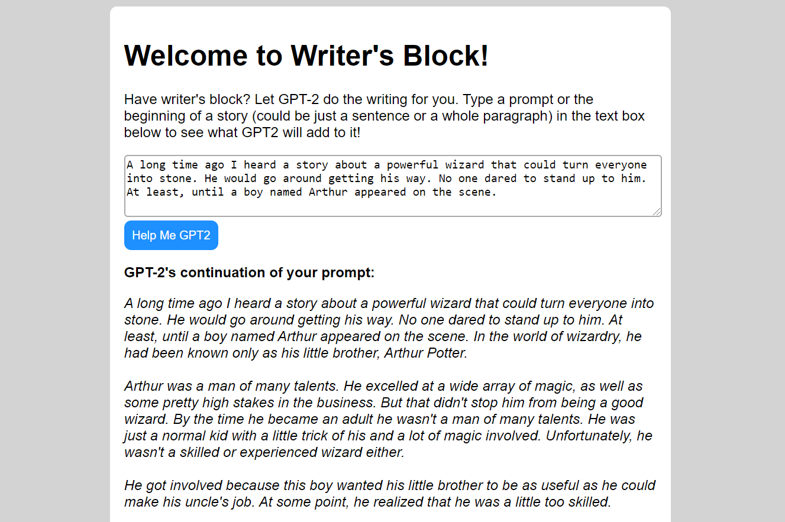

# An AI Language Model Web Server

Includes an AI server hosting a lightweight GPT-2 process and a web app server that serves up a simple UI for interacting with GPT-2. Both interact with each other via Redis. This allows for the AI server and web app server to be deployed on multiple nodes. Redis is used as a job queue for calls to GPT-2 and as a cache for results to queries already made to GPT-2.

Here is an example of GPT-2 continuing a prompt int he web app UI:



## Deploying

To deploy an AI server:

```shell
git clone https://github.com/epeters3/writers-block.git
cd writers-block
bash deploy-ai.sh
```

To deploy an HTTP API server:

```shell
git clone https://github.com/epeters3/writers-block.git
cd writers-block
bash deploy-api.sh
```

By default, the UI corresponding to the HTTP API server should be accessible at `http://localhost:5000/`

\*Make sure a Redis instance is configured and accessible inside the `writersblock.db` module. If redis and both servers are running on the same machine, this repo should theoretically work out of the box.
